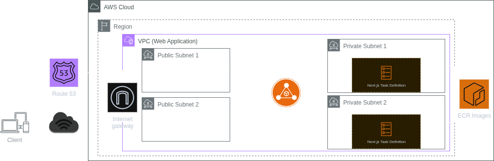

# Introduction

Hello my tech and infra babies if u have any qns pls reach out to me @shagrirse

1. Ensure configuration (`config.ini`) and `tfvars` files in each subdirectory are configred (refer to examples for required fields).
2. Deploy the ECR Repository and scoped images by executing `./deployEcrRepoImages.sh`
  - you might want to give execution rights on the file by doing `chmod +x deployEcrRepoImages.sh`
3. Once the ECR Repository has been deployed, `cd` into `ecs` and execute `terraform plan`. Ensure there are no errors and all variables are correct.
4. `terraform apply`
5. $$$ profit $$$